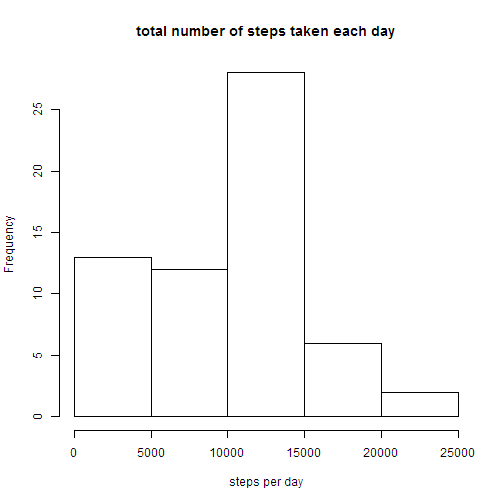
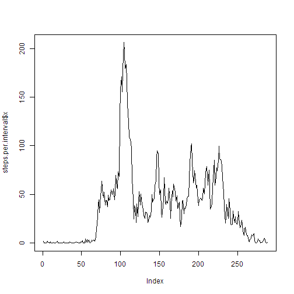
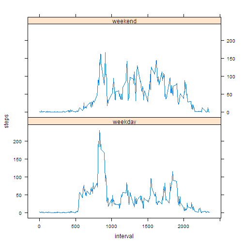

# Reproducible Research: Peer Assessment 1


## Loading and preprocessing the data

```r
data <- read.table(unz("activity.zip", "activity.csv"), header = TRUE, sep = ",", 
    stringsAsFactors = F, colClasses = c("integer", "Date", "integer"))
```


## Mean total number of steps taken per day

```r
steps.per.day <- tapply(data$steps, data$date, sum, na.rm = T)
hist(steps.per.day, main = "total number of steps taken each day", xlab = "steps per day")
```

 

```r
total.mean <- mean(steps.per.day, na.rm = T)
total.median <- median(steps.per.day, na.rm = T)
```

The mean total number of steps taken per day is   9354.23,
and the median is 10395.


## Average daily activity pattern

```r
steps.per.interval <- aggregate(data$steps, by = list(data$interval), FUN = mean, 
    na.rm = T)
plot(steps.per.interval$x, type = "l")
```

 

```r

max.interval <- which.max(steps.per.interval$x)
```


The 104-th 5-minute interval on average across all the days in the dataset (this one:  835) contains the maximum number of steps(206.17 steps).

## Imputing missing values

```r
max.value.count <- sum(is.na(data$steps))
```

There were 2304 NA values.

For filling in all of the missing values in the dataset we use the mean for that 5-minute interval.


```r
rounded.value.for.interval <- function(interval) {
    round(steps.per.interval$x[steps.per.interval$Group.1 == interval])
}

data.tidy <- data
data.tidy$steps[is.na(data$steps)] <- sapply(data$interval[is.na(data$steps)], 
    rounded.value.for.interval)
```


## Differences in activity patterns between weekdays and weekends

```r
steps.per.day.tidy <- aggregate(c(data.tidy$steps), by = list(data.tidy$date), 
    FUN = sum)
names(steps.per.day.tidy) <- c("date", "steps")
hist(steps.per.day.tidy$steps, main = "total number of steps taken each day", 
    xlab = "steps per day")
```

 

```r
tidy.mean <- mean(steps.per.day.tidy$steps)
tidy.median <- median(steps.per.day.tidy$steps)
```

The mean total number of steps taken per day is 10765.64.
The median total number of steps taken per day is    10762.


```r
data.tidy$weekdays <- factor(c(ifelse(weekdays(data.tidy$date) == "Sunday" | 
    weekdays(data.tidy$date) == "Saturday", "weekend", "weekday")))

steps.per.weekdays <- aggregate(data.tidy$steps, by = list(data.tidy$interval, 
    data.tidy$weekdays), FUN = mean)

names(steps.per.weekdays) <- c("interval", "weekdays", "steps")

library(lattice)
xyplot(steps ~ interval | weekdays, data = steps.per.weekdays, layout = c(1, 
    2), type = "l")
```

 


