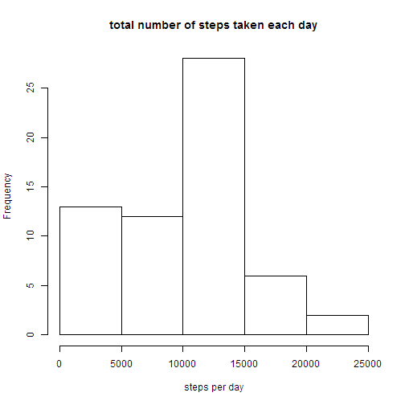

# Reproducible Research: Peer Assessment 1


## Loading and preprocessing the data

```r
data <- read.table(unz("activity.zip", "activity.csv"), header = TRUE, sep = ",", 
    stringsAsFactors = F, colClasses = c("integer", "Date", "integer"))
```


## What is mean total number of steps taken per day?

```r
steps.per.day <- tapply(data$steps, data$date, sum, na.rm = T)
hist(steps.per.day, main = "total number of steps taken each day", xlab = "steps per day")
```

 

```r
print(mean(steps.per.day))
```

```
## [1] 9354
```

```r
print(median(steps.per.day))
```

```
## [1] 10395
```


## What is the average daily activity pattern?


## Imputing missing values


## Are there differences in activity patterns between weekdays and weekends?
